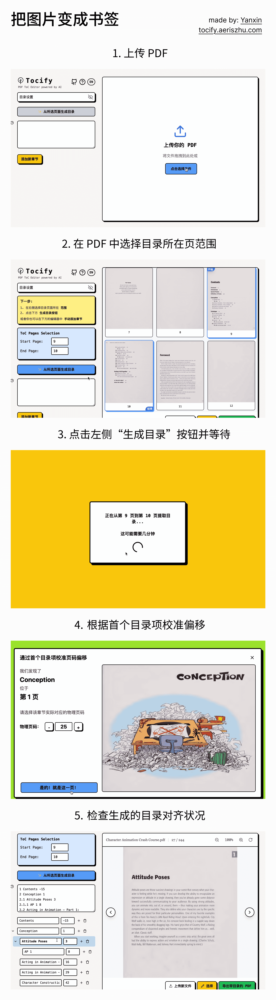
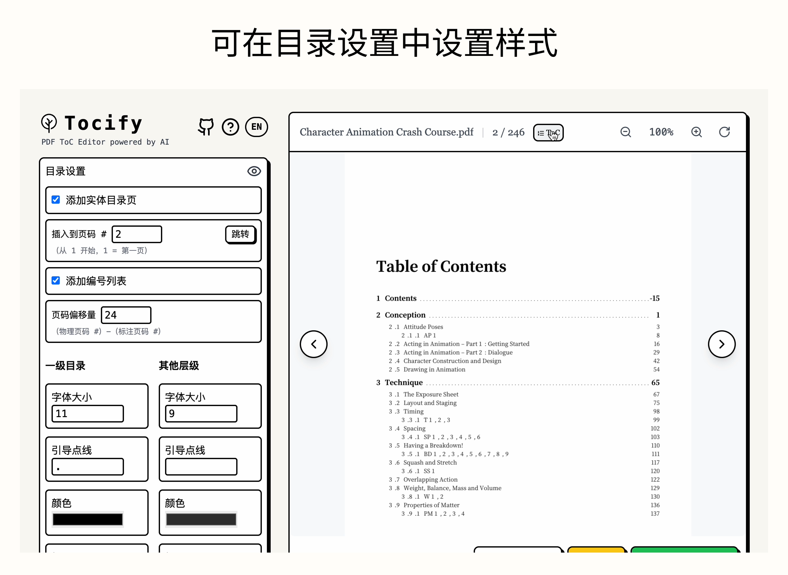

<h1>
  Tocify
  
</h1>

Tocify is a free, online and open-source web application to add, edit, or generate Table of Contents (ToCs) / bookmarks for PDFs. It uses AI to parse scanned directory images or raw text into structured outlines, and creates clickable bookmarks & printable TOC pages for PDFs in cross platforms.

## Usage

<https://github.com/user-attachments/assets/48e09103-f3a8-4d13-afeb-d11b5c8ade44>

---

### 1. Basic

### 2. Format text

### 3. Edit style

## Support me

You can support me by Alipay (scan QR code below) or [ko-fi](https://ko-fi.com/aerisz):

