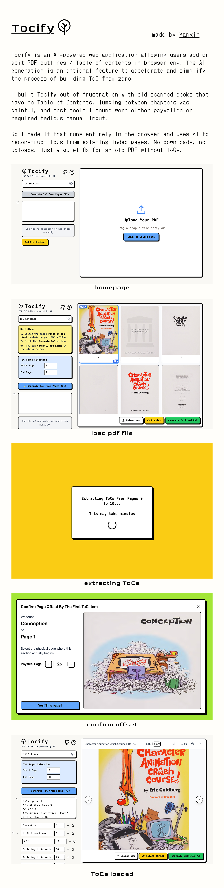

<h1>
  Tocify
  
</h1>

Tocify is an AI-powered web application allowing users add or edit PDF outlines / Table of contents in browser env.

## Usage Demo

<https://github.com/user-attachments/assets/98313674-670e-4afa-bf2d-887c3a5694b5>

---

